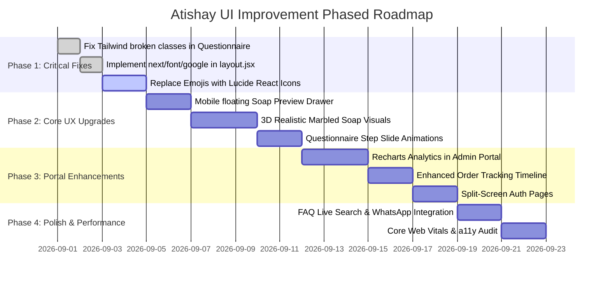

# 🌿 Atishay Frontend — UI/UX Comprehensive Improvement Guide

This document presents an in-depth, actionable UI/UX analysis and improvement roadmap for the **Atishay** personalized organic soap e-commerce application (`soap-website-frontend`). It outlines specific aesthetic enhancements, component bug fixes, accessibility upgrades, and interactive features to elevate the application to a luxury, modern e-commerce standard.

---

## 📌 Table of Contents
1. [Executive Summary & Current UI Audit](#1-executive-summary--current-ui-audit)
2. [Design System & Foundation Upgrades](#2-design-system--foundation-upgrades)
3. [Fixing Critical Tailwind & CSS Inconsistencies](#3-fixing-critical-tailwind--css-inconsistencies)
4. [Iconography & Media Asset Modernization](#4-iconography--media-asset-modernization)
5. [Page-by-Page UI/UX Improvement Roadmap](#5-page-by-page-uiux-improvement-roadmap)
   - [5.1 Navigation & Global Header](#51-navigation--global-header)
   - [5.2 Global Footer](#52-global-footer)
   - [5.3 Homepage Sections](#53-homepage-sections)
   - [5.4 Diagnostic Questionnaire (`/questionnaire`)](#54-diagnostic-questionnaire-questionnaire)
   - [5.5 Live 3D Soap Preview Component (`SoapPreview.jsx`)](#55-live-3d-soap-preview-component-soappreviewjsx)
   - [5.6 Order Confirmation & Checkout (`/order-confirmation`)](#56-order-confirmation--checkout-order-confirmation)
   - [5.7 Customer Dashboard & Order History (`/dashboard`)](#57-customer-dashboard--order-history-dashboard)
   - [5.8 Order Tracking & Stepper (`/dashboard/orders/[id]`)](#58-order-tracking--stepper-dashboardordersid)
   - [5.9 Admin Operations Portal (`/admin`)](#59-admin-operations-portal-admin)
   - [5.10 Authentication Pages (`/login` & `/register`)](#510-authentication-pages-login--register)
   - [5.11 Support Pages (`/faq` & `/contact`)](#511-support-pages-faq--contact)
6. [Accessibility (a11y), SEO & Performance Checklist](#6-accessibility-a11y-seo--performance-checklist)
7. [Phased Implementation Priority Matrix](#7-phased-implementation-priority-matrix)

---

## 1. Executive Summary & Current UI Audit

### Strengths of Current Build
- **Harmonious Botanical Color Concept**: The Sage Green (`#5D7B6F`), Warm Gold (`#D4A574`), and Cream (`#F9F7F2`) brand colors reflect an organic, natural Ayurvedic aesthetic.
- **End-to-End Functional Flow**: All pages (Quiz $\rightarrow$ Order Summary $\rightarrow$ Payment $\rightarrow$ Dashboard $\rightarrow$ Admin) are wired with backend APIs and client-side demo fallbacks.
- **Micro-Animations with Framer Motion**: Smooth entry transitions and floating animations on the hero and cards.

### Core UI/UX Areas Needing Improvement
1. **Over-reliance on Raw Emojis**: Emojis (`🌿`, `🧼`, `🔬`, `✨`, `🪴`, `🪵`, `🌸`, `📦`, `👩‍💼`) are used as primary icons, which can look casual instead of a luxury organic cosmetic brand. `lucide-react` is already installed in `package.json` and should be utilized.
2. **Broken & Missing CSS Classes in Questionnaire**: `questionnaire/page.jsx` contains undefined Tailwind classes like `text-text-muted`, `bg-neutral`, `bg-accent-hover`, and `border-amber-900/10` that fail to render intended styles.
3. **Mobile Quiz Experience Gap**: The live `SoapPreview` is hidden on mobile screens (`hidden sm:block`), depriving mobile users of the immediate visual feedback of their custom soap being created.
4. **Under-utilized Installed Libraries**:
   - `recharts` is installed but not used in the Admin dashboard for sales analytics or skin type distribution.
   - `lucide-react` is installed but rarely imported.
5. **Static Product Visuals**: Soap bars and ingredient showcases use flat CSS boxes rather than photorealistic renders, organic marbling textures, or high-definition botanical imagery.
6. **Font Loading Strategy**: Fonts are loaded via `@import` in `globals.css`, causing Cumulative Layout Shift (CLS) instead of using Next.js 14 optimized `next/font/google`.

---

## 2. Design System & Foundation Upgrades

### 2.1 Next.js 14 Font Optimization (`next/font/google`)
Replace external `@import` in CSS with `next/font/google` in `src/app/layout.jsx` to prevent layout shifts and enable zero-runtime font caching:

```jsx
// src/app/layout.jsx
import { Poppins, Inter, Lora } from 'next/font/google';

const poppins = Poppins({
  subsets: ['latin'],
  weight: ['400', '500', '600', '700', '800'],
  variable: '--font-poppins',
  display: 'swap',
});

const inter = Inter({
  subsets: ['latin'],
  weight: ['300', '400', '500', '600', '700'],
  variable: '--font-inter',
  display: 'swap',
});

const lora = Lora({
  subsets: ['latin'],
  weight: ['400', '500', '600'],
  style: ['normal', 'italic'],
  variable: '--font-lora',
  display: 'swap',
});

export default function RootLayout({ children }) {
  return (
    <html lang="en" className={`${poppins.variable} ${inter.variable} ${lora.variable}`}>
      <body className="font-inter bg-cream text-charcoal min-h-screen flex flex-col justify-between antialiased">
        {children}
      </body>
    </html>
  );
}
```

### 2.2 Extended Tailwind Configuration
Update `tailwind.config.js` to define consistent design tokens, shadow elevations, glassmorphism utilities, and animation keyframes:

```javascript
/** @type {import('tailwindcss').Config} */
module.exports = {
  content: [
    './src/pages/**/*.{js,ts,jsx,tsx,mdx}',
    './src/components/**/*.{js,ts,jsx,tsx,mdx}',
    './src/app/**/*.{js,ts,jsx,tsx,mdx}',
  ],
  theme: {
    extend: {
      colors: {
        primary: {
          DEFAULT: '#5D7B6F', // Sage Green
          hover: '#4E6A5F',
          dark: '#3D5047',
          light: '#E8EAE1',
          surface: '#F2F4EE',
        },
        secondary: {
          DEFAULT: '#D4A574', // Warm Gold
          hover: '#C29463',
          light: '#F7EBDD',
          dark: '#B58552',
        },
        accent: {
          DEFAULT: '#8B7355', // Earth Brown
          hover: '#7A6449',
          light: '#E8D5CC',   // Soft Blush
          dark: '#5D4E39',
        },
        cream: {
          DEFAULT: '#F9F7F2', // Background Off-White
          light: '#FCFBF8',
          dark: '#EFECE4',
          muted: '#E5E1D5',
        },
        charcoal: {
          DEFAULT: '#2B3B3B', // Deep Charcoal Text
          light: '#596565',   // Body Subtitle
          muted: '#8C9797',   // Borders & Placeholders
        },
        botanical: {
          aloe: '#78B89E',
          haldi: '#E8B84F',
          chandan: '#D4A882',
          kesar: '#F48E4D',
          neem: '#4E8A63',
        },
        status: {
          error: '#D64545',
          'error-bg': '#FDF2F2',
          success: '#4E9E67',
          'success-bg': '#F0F9F3',
          warning: '#D97706',
          'warning-bg': '#FEF3C7',
          info: '#2563EB',
          'info-bg': '#EFF6FF',
        },
      },
      fontFamily: {
        poppins: ['var(--font-poppins)', 'sans-serif'],
        inter: ['var(--font-inter)', 'sans-serif'],
        lora: ['var(--font-lora)', 'serif'],
      },
      boxShadow: {
        'subtle': '0 2px 8px -2px rgba(43, 59, 59, 0.05)',
        'medium': '0 8px 24px -4px rgba(43, 59, 59, 0.08)',
        'large': '0 16px 40px -8px rgba(43, 59, 59, 0.12)',
        'soap-glow': '0 20px 50px -10px rgba(93, 123, 111, 0.35)',
        'inner-light': 'inset 0 1px 1px 0 rgba(255, 255, 255, 0.6)',
      },
      borderRadius: {
        'subtle': '6px',
        'default': '10px',
        'large': '14px',
        'extra': '20px',
        'pill': '9999px',
      },
    },
  },
  plugins: [],
};
```

---

## 3. Fixing Critical Tailwind & CSS Inconsistencies

### Questionnaire Color Class Discrepancies
In `src/app/questionnaire/page.jsx`, multiple classes reference undefined tokens. The table below lists the issue and exact fix:

| Line / Element in `questionnaire/page.jsx` | Current Broken Class | Correct Tailwind Token Replacement |
|---|---|---|
| Card container | `border-amber-900/10` | `border-primary/15` |
| Progress Bar Track | `bg-neutral` | `bg-cream-dark` |
| Subtitle / Descriptions | `text-text-muted` | `text-charcoal-light` |
| Option Card background (inactive) | `bg-neutral/30` | `bg-cream/50` |
| Back Button hover | `hover:bg-neutral` | `hover:bg-cream-dark` |
| Continue Button | `bg-accent hover:bg-accent-hover` | `bg-primary hover:bg-primary-hover text-cream` |
| Submit Button | `bg-emerald-600 hover:bg-emerald-700` | `bg-status-success hover:bg-emerald-700 text-cream` |
| Step Heading | `text-primary` | `text-charcoal` (for high contrast readability) |

---

## 4. Iconography & Media Asset Modernization

Replace arbitrary emojis with sharp, scalable vector icons from `lucide-react`:

| Current Emoji | Replaced With (`lucide-react`) | Usage Location |
|---|---|---|
| 🌿 | `<Leaf className="w-5 h-5 text-primary" />` | Brand logo, badges, organic tags |
| 🧼 | `<Sparkles className="w-5 h-5 text-secondary" />` | Soap formulation icons, quiz actions |
| 🔬 | `<FlaskConical className="w-5 h-5 text-primary" />` | Science-backed highlights, formula matching |
| 📋 | `<ClipboardCheck className="w-5 h-5 text-primary" />` | How it Works Step 1, Diagnostic Quiz |
| 📦 | `<Package className="w-5 h-5 text-secondary" />` | Shipping, delivery policies, tracking |
| 🛡️ | `<ShieldCheck className="w-5 h-5 text-primary" />` | Allergen exclusion guarantee, Admin button |
| ⚠️ | `<AlertTriangle className="w-5 h-5 text-status-warning" />` | Patch test safety warning |
| 🚚 | `<Truck className="w-5 h-5 text-accent" />` | Shipped order badge |
| 🔄 | `<RefreshCw className="w-4 h-4" />` | Re-order formula, refresh metrics |
| 💳 | `<CreditCard className="w-5 h-5 text-cream" />` | Razorpay payment CTA |
| 🔍 | `<Search className="w-4 h-4 text-charcoal-muted" />` | FAQ & Admin Search inputs |

---

## 5. Page-by-Page UI/UX Improvement Roadmap

### 5.1 Navigation & Global Header
- **Current State**: Static header with simple mobile toggle; active routes are not highlighted.
- **Improvements**:
  1. **Active Route Highlighting**: Add underline pill or bold active state for the current route using `usePathname()`.
  2. **Elevated User Menu**: Replace plain `Dashboard | Admin | Logout` inline links with an avatar badge and dropdown menu showing the user's name, email, and quick links.
  3. **Cart / Quick Quiz Floating Badge**: Include a persistent pill indicating whether a diagnostic is in progress.
  4. **Smooth Mobile Drawer**: Add backdrop blur overlay (`fixed inset-0 bg-charcoal/40 backdrop-blur-sm`) and slide-in motion for mobile drawer.

```jsx
// Example User Avatar Menu Enhancement for Header.jsx
<div className="relative group">
  <button className="flex items-center gap-2 py-1.5 px-3 rounded-large bg-primary/10 hover:bg-primary/20 text-primary-dark font-poppins font-semibold text-xs transition">
    <div className="w-6 h-6 rounded-full bg-primary text-cream flex items-center justify-center text-[10px] font-bold">
      {userName?.[0]?.toUpperCase() || 'U'}
    </div>
    <span>{userName || 'Account'}</span>
    <ChevronDown className="w-3.5 h-3.5" />
  </button>
  {/* Dropdown Menu */}
</div>
```

---

### 5.2 Global Footer
- **Current State**: Standard 5-column layout with static email form.
- **Improvements**:
  1. **Interactive Newsletter Feedback**: Add validation and instant visual confirmation upon subscription.
  2. **Trust Badges Row**: Add an authentic certification ribbon above copyright (e.g., *100% Biodegradable*, *Cruelty-Free PETA Certified*, *Ayush Approved Formulations*, *Cold-Pressed Extraction*).
  3. **Patch Test Notice Card**: Style with a soft amber gradient and an info modal link explaining the 24h patch test steps.

---

### 5.3 Homepage Sections

#### Hero Section (`HeroSection.jsx`)
- **Visual Polish**:
  - Replace the single CSS soap card with an interactive 3D perspective-tilted soap mockup with organic gold mica veins and translucent edges.
  - Add floating botanical leaves with subtle parallax movement.
  - Implement a dynamic formula counter: `"5,420+ Custom Bars Formulated in 2026"`.

#### How It Works (`HowItWorks.jsx`)
- **Visual Connection Path**:
  - Add an animated dashed connector line connecting Steps 1 $\rightarrow$ 2 $\rightarrow$ 3 $\rightarrow$ 4 on desktop screens.
  - Add step duration indicators (e.g., `Step 1: 2 Minutes`, `Step 3: Hand-cured 24h`).

#### Ingredients Showcase (`IngredientsShowcase.jsx`)
- **Interactive Tabs & Rich Botanical Cards**:
  - Add filter tabs: `All Botanicals | Acne Defense | Deep Hydration | Calming Care | Radiance Glow`.
  - Include botanical Latin names (*Curcuma longa*, *Aloe barbadensis Miller*, *Santalum album*, *Crocus sativus*).
  - Add sensory notes tags: `Aroma: Woody & Warm`, `Lather: Rich & Velvety`.

#### Quiz Preview Section (`QuizPreviewSection.jsx`)
- **Interactive Teaser**:
  - Make the options inside the diagnostic preview interactive on the homepage. When the user clicks an option, save it directly to `useQuestionnaireStore` and navigate to `/questionnaire` with Question 1 already completed.

#### Best Sellers (`BestSellers.jsx`)
- **Card Enhancements**:
  - Add review rating count (`★ 4.9 (148 reviews)`).
  - Add a "Quick Formula Specs" hover popover detailing pH level (5.5 Balanced), key oil bases (Coconut & Olive), and cure time.
  - Add a direct "Customize This Base" button.

#### Testimonials (`Testimonials.jsx`)
- **Social Proof Polish**:
  - Replace emoji avatars with styled initial badges or verified customer avatar images.
  - Add skin before/after journey tags (e.g. `Skin Concern: Cystic Acne → Resolved in 4 weeks`).
  - Add interactive slider navigation buttons for smooth carousel scrolling.

---

### 5.4 Diagnostic Questionnaire (`/questionnaire`)

#### Mobile Live Preview Solution
On mobile devices, `SoapPreview` is currently hidden. To fix this:
1. Add a **Sticky Bottom Sheet / Drawer** on mobile with a `"View Custom Formula Bar (Live)"` trigger button.
2. Clicking it slides up a compact preview card with live ingredient additions and allergy exclusions.

#### Question Progression & Animation
- Wrap each question in Framer Motion `<AnimatePresence mode="wait">` for a smooth slide-left / slide-right page transition when pressing Next / Back.
- Add clickable progress step pills at the top so users can quickly jump back to edit earlier questions without multiple clicks.

#### Question 6 Delivery Enhancements
- Add automatic City and State auto-fill upon entering a valid 6-digit Indian PIN code.
- Add phone number formatting with `+91` prefix badge.

---

### 5.5 Live 3D Soap Preview Component (`SoapPreview.jsx`)

#### Realistic Soap Bar Aesthetics
Enhance the visual soap representation:
- **Translucent Glycerine Effect**: Use CSS backdrop blur, inset light highlights (`inset 0 1px 2px rgba(255,255,255,0.7)`), and subtle linear gradient marbling.
- **Embedded Botanical Specks**:
  - For **Haldi**: Golden amber swirl with micro turmeric granules.
  - For **Aloe**: Soothing translucent seafoam green with fresh gel texture.
  - For **Chandan**: Earthy sandalwood tone with fine wooden grain texture.
  - For **Kesar**: Warm saffron golden hue with crimson saffron strands overlay.
- **Exfoliating Scrub Texture Toggle**: Render subtle botanical oatmeal seed specks when `exfoliating` texture is chosen.
- **Custom Engraved Stamp**: Modern debossed brand seal with customized user name (e.g. *"Handcrafted for Priya"*).

---

### 5.6 Order Confirmation & Checkout (`/order-confirmation`)
- **Trust Badges**: Add SSL 256-Bit Encrypted & Razorpay Verified trust seals.
- **Interactive Price Breakdown**:
  - Itemized bar chart or breakdown pill showing Base Bar (₹399) + Addons (₹50) + Shipping (FREE) + Taxes Included.
- **Delivery Date Countdown**: Add an animated badge: `"Expected Dispatch: Within 24 Hours • Delivery by Friday"`.
- **Patch Test Accordion**: Include a 3-step illustrated patch test guide right inside the checkout summary.

---

### 5.7 Customer Dashboard & Order History (`/dashboard`)
- **Skin Profile Summary Card**: Display a dedicated "Your Verified Skin Profile" card at the top showing registered skin type, allergen exclusions, and recommended re-order cycle (every 45 days).
- **Interactive Re-Order Modal**: Allow one-click re-order with optional minor formula tweaks before checkout.
- **Downloadable Recipe PDF**: Add a "Download Dermatologist Formulation Card" button for every completed order.

---

### 5.8 Order Tracking & Stepper (`/dashboard/orders/[id]`)
- **Interactive Responsive Stepper**:
  - Desktop: Horizontal timeline with glowing checkmarks and progress bar.
  - Mobile: Vertical card with timestamp history and courier tracking link (`Track on Courier Partner Portal →`).
- **Care & Storage Tips**: Add a card on how to store vegetable glycerine soap to maximize bar longevity (e.g. well-drained wooden soap dish).

---

### 5.9 Admin Operations Portal (`/admin`)

#### Analytical Charts with Recharts
Integrate `recharts` (already in `package.json`) into the top of `/admin`:
1. **Revenue & Order Trend (AreaChart / LineChart)**: 7-day or 30-day sales overview.
2. **Skin Profile Breakdown (PieChart / DonutChart)**: Distribution of customer profiles (Oily vs Dry vs Sensitive vs Combo).
3. **Batch Production Status (BarChart)**: Orders pending vs in-production vs shipped.

```jsx
// Example Recharts Integration for Admin Dashboard
import { ResponsiveContainer, AreaChart, Area, XAxis, YAxis, Tooltip, PieChart, Pie, Cell } from 'recharts';

const revenueData = [
  { day: 'Mon', revenue: 2400 },
  { day: 'Tue', revenue: 3600 },
  { day: 'Wed', revenue: 4200 },
  { day: 'Thu', revenue: 3100 },
  { day: 'Fri', revenue: 5800 },
  { day: 'Sat', revenue: 7400 },
  { day: 'Sun', revenue: 6900 },
];
```

#### Order Management Table Enhancements
- **Search & Filter Bar**: Instant search by customer name, email, or order ID.
- **CSV Export**: Add a `"Export Batch Sheet (CSV)"` button for factory mold dispatch.
- **Quick Status Change**: Inline status dropdown to update multiple orders rapidly.

---

### 5.10 Authentication Pages (`/login` & `/register`)
- **Split-Screen Luxury Layout**:
  - **Left Column**: High-aesthetic imagery with glowing testimonial, Ayurvedic botanical philosophy quote, and trust badges.
  - **Right Column**: Clean form with floating labels, password visibility toggle (`<Eye />` / `<EyeOff />`), real-time password strength meter, and quick diagnostic quiz link.

---

### 5.11 Support Pages (`/faq` & `/contact`)
- **FAQ Real-Time Search**: Add a search input at the top of `/faq` that instantly filters questions as the user types.
- **Category Filter Pills**: `All Questions | Custom Formulation | Safety & Allergies | Shipping & Delivery | Returns`.
- **Direct WhatsApp Chat CTA**: Add a direct `Chat on WhatsApp (+91 98765 43210)` button on `/contact` for instant customer consultation.

---

## 6. Accessibility (a11y), SEO & Performance Checklist

### Accessibility (WCAG 2.1 AA)
- [ ] Ensure all interactive buttons and inputs have visible `:focus-visible` outline rings with adequate contrast.
- [ ] Replace bare icon buttons with `aria-label` tags (e.g. `<button aria-label="Close modal">`).
- [ ] Verify color contrast ratio on secondary text (`text-charcoal-light` on `bg-cream` must exceed 4.5:1).
- [ ] Ensure all accordions in FAQ and Order details use `aria-expanded` and semantic `<button>` triggers.

### Performance & Core Web Vitals
- [ ] Replace standard `` with `next/image` with proper `sizes` and blur placeholders.
- [ ] Use `next/font/google` to eliminate render-blocking external font CSS imports.
- [ ] Add `dynamic()` imports for heavy components like `recharts` in the admin dashboard to minimize initial bundle size.

### SEO & Metadata
- [ ] Set dynamic OpenGraph (`og:image`, `og:title`, `og:description`) tags in `src/app/layout.jsx`.
- [ ] Add JSON-LD Structured Data for LocalBusiness and Product schemas on `/` and `/order-confirmation`.

---

## 7. Phased Implementation Priority Matrix



### Summary of Priority Actions

| Priority | Task | Target File | Impact |
|---|---|---|---|
| 🔴 **P0 (Immediate)** | Fix broken Tailwind tokens (`text-text-muted`, `bg-neutral`, etc.) | `src/app/questionnaire/page.jsx` | Fixes broken UI styling & contrast |
| 🔴 **P0 (Immediate)** | Adopt `next/font/google` for Poppins, Inter, and Lora | `src/app/layout.jsx` | Eliminates layout shift & speeds font load |
| 🟡 **P1 (High)** | Replace emoji clutter with `lucide-react` icons | Across all components | Instant luxury brand elevation |
| 🟡 **P1 (High)** | Implement Mobile Drawer for Live Soap Preview | `src/app/questionnaire/page.jsx` | Solves missing preview on mobile screens |
| 🟡 **P1 (High)** | Realistic 3D Translucent Marbled Soap Bar Styling | `src/components/SoapPreview.jsx` | Wow factor & high conversion diagnostic |
| 🟢 **P2 (Medium)** | Add Recharts analytics (revenue & skin types) | `src/app/admin/page.jsx` | Professional admin operations |
| 🟢 **P2 (Medium)** | Split-Screen luxury redesign for Login & Register | `src/app/login/page.jsx`, `register/page.jsx` | Higher conversion & trust |
| 🟢 **P3 (Polish)** | Live FAQ Search & Direct WhatsApp Chat Button | `src/app/faq/page.jsx`, `contact/page.jsx` | Frictionless customer support |

---

*Authored for Atishay Development Team — Prepared on August 27, 2026.*
